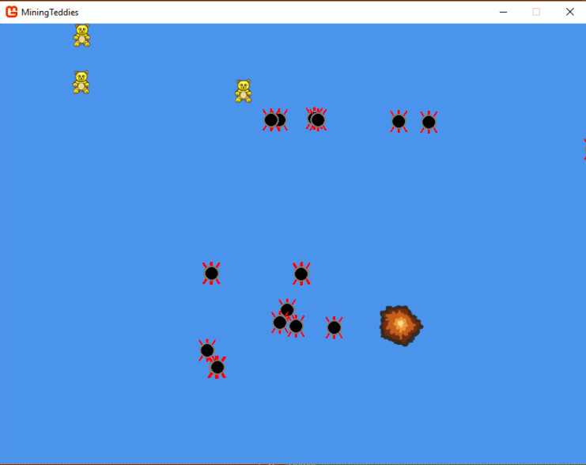

# MiningTeddies

A simple game where you place mines to explode teddy bears.

## Getting Started

These instructions will get you a copy of the project up and running on your local machine for development and testing purposes.

### Prerequisites

```
Visual Studios, MonoGame
```

## Running the tests

Left click to place a mine. When a teddy bear makes contact with a mine, they explode.




## Author

**Steven Duong**
